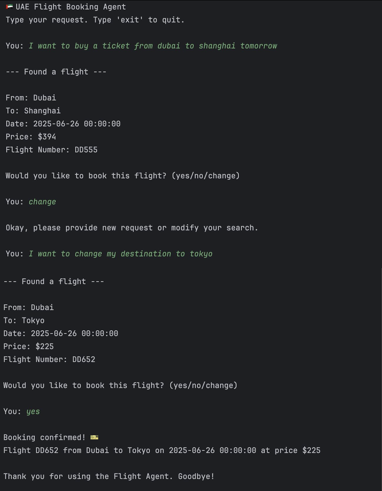
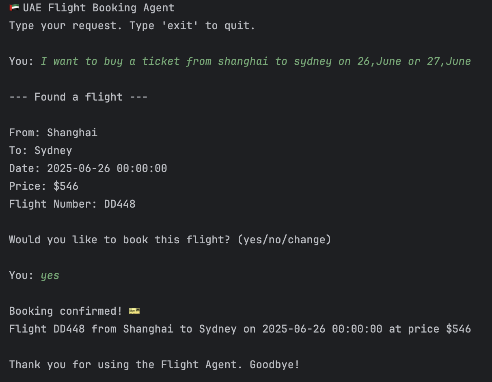
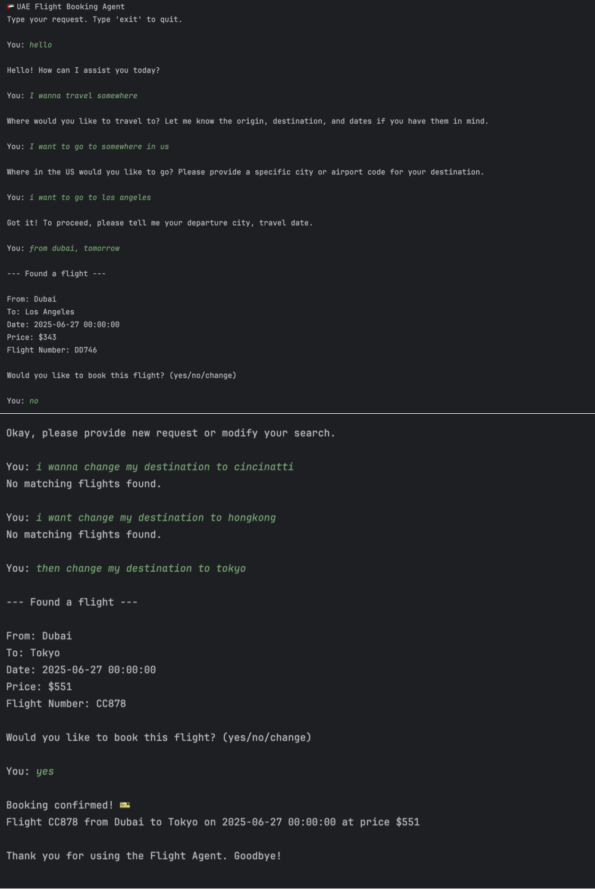

# UAE Flight Booking Agent 

This is a demo project for building a conversational flight booking agent using LangChain and OpenAI LLM.  
It supports:

✅ multi-turn dialogue  
✅ memory-based slot filling  
✅ fuzzy date parsing (single date or range)  
✅ user confirmation before booking

## Implementation Flow

1️⃣ **Data preparation**  
→ Run `data_generation.py` → generate `flights.jsonl` with random flight data (origin, destination, flight_number, date, price)

2️⃣ **Start agent**  
→ Run `flight_agent.py`

3️⃣ **User input**  
→ User types request in terminal (e.g. "I want to fly from Paris to Tokyo next week")

4️⃣ **Intent extraction**  
→ LLM parses:
    - `origin`
    - `destination`
    - `date_start`
    - `date_end`

5️⃣ **Memory merge**  
→ If user only gives partial update (e.g. "change date to next month"), previous slots are filled from memory

6️⃣ **Flight search**  
→ Search `flights.jsonl` using Pandas with filters:
    - origin
    - destination
    - date range (date_start to date_end)

7️⃣ **Present result**  
→ Show cheapest matching flight to user

8️⃣ **User confirmation**  
→ Wait for "yes" / "no" / "change"

9️⃣ **Booking**  
→ On "yes" → confirm booking → exit
  else return to step 3

---

## Data Generation

Run the data generation script first:

```bash
python data_generation.py
```

This will create flights.jsonl — a fake dataset containing random flights with:

1.origin
2.destination
3.flight_number
4.date
5.price

---

## Features

- Conversational flight booking via terminal chat  
- Extracts intent fields:
  - `origin`
  - `destination`
  - `date_start`
  - `date_end`
- Supports **multi-turn updates**:
  - e.g. "change my date to next week", "change destination to Tokyo"
- Handles **fuzzy dates**:
  - "this month", "next week", "June 30"
- Keeps **memory** of previous slots
- Asks for **explicit confirmation** before booking
- Returns **cheapest matching flight**

---

## Run the Agent

Run the agent program:

```bash
python flight_agent.py
```

Note:
You need to provide your own OpenAI API Key in the code.
In flight_agent.py, you will see the following line:

```
my_api_key = ""

llm = ChatOpenAI(
    model_name="gpt-3.5-turbo",
    temperature=0,
    openai_api_key=my_api_key
)
```
For security reasons, my_api_key is left empty in the code — you need to set your own key before running the agent.

## Updates --version2
### ✅ Key Functional Enhancements

1. **LLM-Based Freeform Interaction**  
   The agent now supports natural language conversation using a large language model (LLM), allowing users to interact freely—not limited to rigid flight request formats.

2. **Incremental Intent Merging**  
   Flight booking intent is dynamically constructed and updated over multiple turns. The system can merge partial inputs (e.g., destination in one turn, origin in another) into a complete query before proceeding.

3. **Context-Aware Route Suggestions**  
   The available flight data is parsed and partially injected into the LLM prompt. This allows the model to answer general questions (e.g., “Where can I fly this week?”) or make valid recommendations.  
   ⚠️ *Note: To avoid overwhelming the LLM with too many options, full route listings are currently limited. A hybrid LLM + rule-based retrieval system is recommended for scaling.*

4. **Memory Completeness Check Before Search**  
   The agent validates that essential booking fields (origin, destination, and date) are present in the conversation memory before performing any flight search. This ensures accuracy and reduces invalid queries.


## 🚀 Screenshots

### Multi-turn Dialogue: Change flight plans based on user needs



### Search within a date range



### Flexible talk with agent




